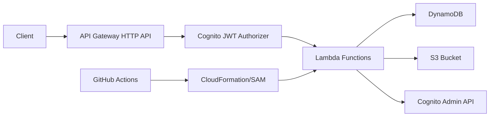

# Documentation Generation Rules (skills.md)

このファイルはAI・開発者が設計書を作成・更新する際に参照する「設計書の書き方定義ファイル」です。
すべてのドキュメント生成はこのファイルのルールに準拠してください。

---

## 1. Doc Types & Templates

### 1.1 DB定義書 (db-definition.md)

**ファイルパス:** `docs/db-definition.md`
**Excelシート名:** テーブル名（例: `GroupwareTable`）
**更新トリガー:** `template.yaml` の DynamoDB AttributeDefinitions/GSI変更時、または新エンティティ追加時

#### Frontmatter（必須）

```yaml
---
sheet_name: DB定義書
output_xlsx: artifacts/db-definition.xlsx
source: template.yaml, backend/functions/*/models.py
version: x.y.z
last_updated: YYYY-MM-DD
---
```

#### セクション構造

```markdown
## テーブル名

### 基本情報

| 項目 | 値 |
|------|-----|
| テーブル名 | groupware-{env} |
| 課金モード | PAY_PER_REQUEST |
| ... | ... |

### エンティティ一覧（PK/SKパターン）

| エンティティ | PK | SK | 説明 |
|------------|----|----|------|
| ユーザー | USER#{userId} | #METADATA | ユーザープロファイル |
| ... | ... | ... | ... |

### 属性定義（エンティティごと）

#### {エンティティ名}

| 属性名 | 型 | 必須 | 説明 | 例 |
|--------|-----|------|------|-----|
| PK | String | ○ | パーティションキー | USER#abc123 |
| ... | ... | ... | ... | ... |

### GSI定義

| GSI名 | PK属性 | SK属性 | ユースケース | ProjectionType |
|-------|--------|--------|-------------|----------------|
| DateRangeIndex | gsi1pk | gsi1sk | スケジュール月次/週次検索 | ALL |
| ... | ... | ... | ... | ... |
```

---

### 1.2 API仕様書 (api-spec.md)

**ファイルパス:** `docs/api-spec.md`
**Excelシート名:** エンドポイントグループ名（例: `Schedules API`）
**更新トリガー:** `backend/functions/*/handler.py` の新ルート追加・変更時

#### Frontmatter（必須）

```yaml
---
sheet_name: API仕様書
output_xlsx: artifacts/api-spec.xlsx
source: backend/functions/*/handler.py, template.yaml
version: x.y.z
last_updated: YYYY-MM-DD
base_url: https://{api-id}.execute-api.ap-northeast-1.amazonaws.com/{env}
auth: Bearer {CognitoIdToken}
---
```

#### セクション構造

```markdown
## {リソース名} (/{path})

### GET /{path}

| 項目 | 内容 |
|------|------|
| 説明 | 一覧取得 |
| 認証 | 必須（Cognito JWT） |
| 権限 | user, admin |

#### クエリパラメータ

| パラメータ名 | 型 | 必須 | 説明 |
|------------|-----|------|------|
| month | string | △ | YYYY-MM形式 |
| ... | ... | ... | ... |

#### レスポンス (200 OK)

| フィールド | 型 | 説明 |
|----------|-----|------|
| events | array | イベント一覧 |
| count | number | 件数 |

#### エラーコード

| HTTP Status | error コード | 発生条件 |
|------------|------------|--------|
| 400 | BAD_REQUEST | パラメータ不正 |
| 401 | UNAUTHORIZED | 認証エラー |
| 403 | FORBIDDEN | 権限不足 |
| 409 | CONFLICT | 重複予約 |
```

---

### 1.3 インフラ構成図 (infrastructure.md)

**ファイルパス:** `docs/infrastructure.md`
**Excelシート名:** `インフラ構成`
**更新トリガー:** `template.yaml` のリソース追加・変更時

#### Frontmatter（必須）

```yaml
---
sheet_name: インフラ構成
output_xlsx: artifacts/infrastructure.xlsx
source: template.yaml, samconfig.toml
version: x.y.z
last_updated: YYYY-MM-DD
---
```

#### セクション構造

```markdown
## アーキテクチャ概要



## AWSリソース一覧

| リソース名 | タイプ | 用途 | 料金ティア |
|----------|--------|------|----------|
| GroupwareApi | HTTP API | REST APIエンドポイント | $1.00/100万リクエスト |
| ... | ... | ... | ... |
```

---

## 2. Source-to-Doc Mapping Rules

| ソースコード | 抽出情報 | 対象設計書 | 抽出方法 |
|------------|---------|----------|---------|
| `template.yaml` → `AttributeDefinitions` | 属性名・型 | db-definition.md | 手動参照 |
| `template.yaml` → `GlobalSecondaryIndexes` | GSI定義 | db-definition.md | 手動参照 |
| `template.yaml` → `Events` (HttpApi) | エンドポイント一覧 | api-spec.md | 手動参照 |
| `backend/functions/*/handler.py` → ROUTES dict | メソッド・パス | api-spec.md | 手動参照 |
| `backend/layers/common/python/response.py` | レスポンス形式 | api-spec.md | 手動参照 |
| `template.yaml` → `Resources` | AWSリソース一覧 | infrastructure.md | 手動参照 |
| `samconfig.toml` → parameters | デプロイ設定 | infrastructure.md | 手動参照 |

---

## 3. Output Rules

### 3.1 YAML Frontmatter 必須項目

すべての `docs/*.md` ファイルはYAML Frontmatterを持つこと。

| フィールド名 | 型 | 必須 | 説明 |
|------------|-----|------|------|
| `sheet_name` | string | ○ | Excelシート名（日本語可）|
| `output_xlsx` | string | ○ | 出力Excelファイルパス |
| `source` | string | ○ | 参照ソースコードパス |
| `version` | string | ○ | セマンティックバージョン |
| `last_updated` | string | ○ | 最終更新日 (YYYY-MM-DD) |

### 3.2 Markdownテーブル記法ルール

- すべてのテーブルはGitHub Flavored Markdown記法に準拠
- ヘッダー行とセパレータ行は必須（`| --- |` 形式）
- セルの値に `|` を含む場合は `\|` でエスケープ
- テーブル前のH2/H3見出しがExcelシート名として使用される
- テーブル内でのMarkdownリンク・コードブロックは使用しない（Excel変換時に消去される）

### 3.3 バージョン管理ルール

```
patch (x.y.Z): 誤字修正、説明文の補足
minor (x.Y.z): 新しいエンドポイント・属性の追加
major (X.y.z): 既存エンドポイント・属性の変更・削除
```

---

## 4. Update Workflow

```
1. コードを変更する
   └─ backend/ または template.yaml を更新

2. 対応するドキュメントを更新する
   └─ この skills.md の Mapping Rules を参照して対象ドキュメントを特定
   └─ docs/*.md を更新（Frontmatter の version と last_updated も更新）

3. Excel を生成する
   └─ python tools/md2excel.py --input docs/db-definition.md --output artifacts/db-definition.xlsx
   └─ python tools/md2excel.py --input docs/api-spec.md --output artifacts/api-spec.xlsx
   └─ python tools/md2excel.py --input docs/infrastructure.md --output artifacts/infrastructure.xlsx
   └─ または python tools/md2excel.py --all（全ドキュメントを一括変換）

4. コミット・プッシュ
   └─ docs/*.md と artifacts/*.xlsx を同時にコミット
   └─ GitHub Actions で自動デプロイ
```

---

## 5. AI への指示（このファイルを参照するAI向け）

AIがコードを生成・変更した際は、以下の手順に従ってドキュメントを更新してください：

1. **変更箇所を特定する:** 変更したファイルが `template.yaml`、`backend/functions/*/handler.py`、`backend/layers/common/python/` のどれに該当するか確認する。
2. **Mapping Rulesを参照する:** セクション2の表から、更新すべき設計書を特定する。
3. **テンプレートを使用する:** セクション1の各ドキュメントテンプレートに従って記述する。
4. **Frontmatterを更新する:** `version` を適切にインクリメントし、`last_updated` を今日の日付にする。
5. **Excel生成コマンドをユーザーに伝える:** 生成すべきExcelファイルとコマンドをユーザーに案内する。
